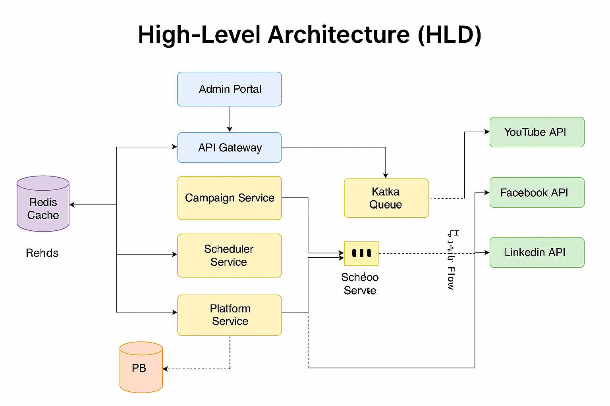
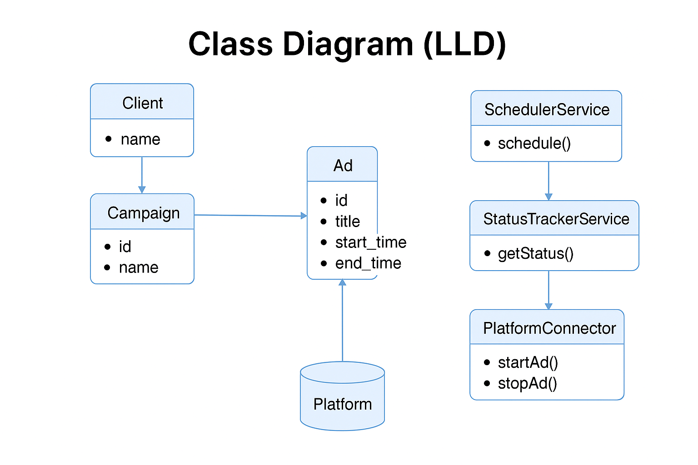

# Ad Management System
## Overview
This system manages advertising campaigns across multiple platforms like YouTube, Google, Facebook, LinkedIn, etc. Clients can create campaigns, schedule ads, and track the status of ads across platforms.
## You want a system where:

- Multiple clients run multiple ad campaigns.
- Each campaign can run on multiple platforms (YouTube, Google Ads, LinkedIn, Facebook, etc.).
- Ads can be scheduled to run for a specific duration (e.g., 3 minutes).
- System tracks active/inactive ads per platform.
- Clients can stop ads on specific platforms or globally anytime.
- Support for querying which ads are active or inactive on which platform.
- Support multiple clients independently.
## Functional Requirements (FRs):
- FR1: Create ad campaigns linked to clients.
- FR2: Schedule ads with start and end times (or duration).
- FR3: Run ads on multiple platforms simultaneously.
- FR4: Stop ads on-demand for one or more platforms.
- FR5: Query status of ads (active/inactive) on each platform.
- FR6: Manage multiple clients independently.

## Non-Functional Requirements (NFRs):
- High availability: Ads must run reliably without downtime.
- Scalability: Support thousands of clients and campaigns.
- Real-time or near real-time status updates.
- Extensibility: Easily add new platforms in future.
- Auditability: Keep history of when ads were started/stopped.
# High-Level Components
````
+---------------------+             +---------------------+
|    Client Portal    | <---------- |  API Gateway / REST |
+---------------------+             +---------------------+
|            |
v            v
+-----------------+  +-----------------+
| Campaign Service|  | Platform Service |
+-----------------+  +-----------------+
|                  |
v                  v
+---------------------+ +---------------------+
| Scheduler Service   | |  Status Tracker     |
+---------------------+ +---------------------+
|                  |
v                  v
+------------------------+  +-------------------+
|   Event Queue (Kafka)   |  | Database(s)       |
+------------------------+  +-------------------+
|                    |
v                    v
+-----------------+     +-----------------+
| Platform Connectors |   | Notification   |
+-----------------+     +-----------------+
````
# Component Explanation
### 1. Client Portal
   - Web UI or API interface where clients create/manage campaigns, schedule ads, view statuses, stop ads.

### 2. API Gateway
   - Entry point for all client requests, authentication, rate limiting, routing.

### 3. Campaign Service
   - Manages campaigns, ads metadata, client info.
   - Supports CRUD operations on campaigns and ads.

### 4. Platform Service
   - Knows which platforms are available (YouTube, Google, LinkedIn, Facebook).
   - Forwards commands to schedule/stop ads to the Scheduler.

### 5. Scheduler Service
   - Handles scheduling logic.
   - Accepts requests to start/stop ads on platforms at specific times.
   - Publishes events to Event Queue for actual execution.
   - Manages timers for ads’ lifecycle (e.g., stop after 3 minutes automatically).

### 6. Status Tracker
   - Tracks ad status (active, inactive) per platform.
   - Provides status queries.

### 7. Event Queue (Kafka or similar)
   - Decouples scheduling and execution.
   - Scheduler publishes start/stop commands.
   - Platform connectors consume events for execution.

### 8. Platform Connectors
   - Components that integrate with external ad platforms’ APIs.
   - Start/stop ads on YouTube, Google, LinkedIn, Facebook, etc.
   - Report status back to Status Tracker.

### 9. Database(s)
   - Store clients, campaigns, ads, schedules, status logs.

### 10. Notification Service (Optional)
   - Notify clients about campaign status changes (email, SMS, webhooks).

# Data Model (High Level)
~~~~
Entity	               Description
---------------------------------------------------------------------------------------
Client                 Client information
Campaign	       Campaign details (name, client_id, etc.)
Ad	               Individual ads (campaign_id, ad content, platforms, duration, status)
Platform	       Platforms like YouTube, Google, etc.
AdSchedule	       Start time, end time for ads
AdStatus	       Current status per platform (Active, Inactive, Paused)
StopRequest	       Logs when an ad or platform is stopped
~~~~
# Example Workflow Scenarios
#### Schedule an Ad for 3 minutes on YouTube & Facebook
1. Client creates campaign and ad with duration 3 minutes, selects platforms YouTube & Facebook.
2. Client requests scheduling via API → Campaign Service → Scheduler Service.
3. Scheduler sets a timer and publishes “start ad” event to Kafka.
4. Platform Connectors consume event and call YouTube & Facebook APIs to start ads.
5. Status Tracker updated to “Active” for those platforms.
6. Scheduler sets another event to stop ad after 3 minutes.
7. After 3 minutes, stop event published → Platform Connectors stop ads.
8. Status Tracker updates status to “Inactive”.
#### Client requests to stop ad immediately on LinkedIn
1. Client calls API to stop the ad on LinkedIn platform.
2. Campaign Service forwards request to Scheduler.
3. Scheduler immediately publishes “stop ad” event to Kafka for LinkedIn.
4. LinkedIn connector consumes event and stops the ad.
5. Status Tracker updates LinkedIn ad status to “Inactive”.
#### Scaling and Extensibility Considerations
- Use event-driven architecture for loosely coupled services.
- Use microservices per platform or group of platforms.
- Store status in a fast key-value store (e.g., Redis) for quick access.
- Schedule timers with distributed scheduler (e.g., Quartz cluster, or a cloud cron service).
- For large scale, use sharding of data by client ID.
- Add rate limiting and retry logic in Platform Connectors.
- Design platform connectors as plugins to easily add/remove platforms.
- Use audit logs for regulatory compliance.
# Technology Stack Suggestions
````
Layer	                    Tech Options
---------------------------------------------------------------------------------------------
API Gateway	            Spring Cloud Gateway / Kong
Campaign & Scheduler	    Spring Boot microservices
Event Queue	            Kafka / RabbitMQ
Database	            PostgreSQL + Redis for cache
Platform Connectors	    Java SDK/REST clients
Notification	            AWS SNS, Twilio, Email Services
Scheduling	            Quartz Scheduler or Cloud Scheduler
````
# Summary Diagram
``````
Client Portal ---> API Gateway ---> Campaign Service ---> Scheduler Service ---> Kafka Queue
                                                                       |
Platform Service ---> Scheduler Service --->
                                                                       |
                                                 +----------------+   +----------------+   +-----------------+
                                                 | YouTube API    |   | Facebook API   |   | LinkedIn API    |
                                                 +----------------+   +----------------+   +-----------------+

Status Tracker <----------------------------------------------------------- Platform Connectors

``````
# Key API Endpoints (REST)
#### Client APIs
- POST /clients — Create client
- GET /clients/{id} — Get client info
#### Campaign APIs
- POST /campaigns — Create campaign (with ads)
- GET /campaigns/{id} — Get campaign details & ads
- PUT /campaigns/{id} — Update campaign (ads, schedule, platforms)
- DELETE /campaigns/{id} — Delete campaign
#### Ad Scheduling APIs
- POST /campaigns/{id}/schedule — Schedule ad start/end time
- POST /ads/{id}/stop — Stop ad immediately (optionally by platform)
#### Status APIs
- GET /ads/{id}/status — Get status of ad on all platforms
- GET /platforms/{name}/active-ads — List active ads on platform
# Scheduling & Starting an Ad
1. Client calls API: POST /campaigns with campaign + ad details, including platforms & schedule.
2. CampaignService.createCampaign() saves data and calls SchedulerService.scheduleAd(ad).
3. SchedulerService publishes a start event to Kafka for each platform.
4. AdEventConsumer consumes event, calls respective platform connector’s startAd().
5. StatusTrackerService marks ad as ACTIVE on those platforms.
6. After the scheduled end time, SchedulerService publishes stop events similarly.
7. Status updated to INACTIVE on platforms.

# Detailed REST API Specs
````
HTTP Method	        URI	                                    Request Body / Params	                                                    Description                                   Response
---------------------------------------------------------------------------------------------------------------------------------------------------------------------------------------------------------------------------
POST	                /clients	                            { "clientId": "...", "name": "...", "contactInfo": "..." }	                    Create a new client	                          201 Created + Client JSON
GET	                /clients/{clientId}	                    None	                                                                    Get client details	                          200 OK + Client JSON
POST	                /campaigns	                            { "campaignId": "...", "clientId": "...", "name": "...", "ads": [...] }	    Create campaign + ads	                  201 Created + Campaign JSON
GET	                /campaigns/{campaignId}	                    None	                                                                    Get campaign details	                  200 OK + Campaign JSON
PUT	                /campaigns/{campaignId}	                    Update campaign or ads info	                                                    Update campaign and ads	                  200 OK + Updated Campaign JSON
DELETE	                /campaigns/{campaignId}	                    None	                                                                    Delete campaign	                          204 No Content
POST	                /campaigns/{campaignId}/schedule	    { "adId": "...", "scheduledStart": "...", "scheduledEnd": "..." }	            Schedule an ad	                          200 OK + Schedule Confirmation
POST	                /ads/{adId}/stop	                    { "platforms": ["YouTube", "Facebook"] }	                                    Stop ad immediately on specified platforms	  200 OK + Stop Confirmation
GET	                /ads/{adId}/status	                    None	                                                                    Get ad status across all platforms	          200 OK + Status JSON
GET	                /platforms/{name}/active-ads	            None	                                                                    Get all active ads on a platform	          200 OK + List of ads
````
#### Key Points:
- Use Spring Data JPA to interact with the database.
- Kafka or RabbitMQ (optional) for event-driven scheduling (start/stop ad).
- Controller layer exposes REST APIs.
- Service layer contains business logic.
- Platform connectors implement integration to external platforms (YouTube, Facebook, etc.).
- Status tracker maintains ad status per platform in-memory or DB.
- Spring Boot starter with Web, Data JPA, Validation dependencies.

## High-Level Design (HLD)

- Clients create **Campaigns** which contain one or more **Ads**.
- Each Ad can run on multiple **Platforms**.
- Ads have a schedule (start & end time).
- The **SchedulerService** manages timed start/stop of ads.
- Platform connectors interact with external APIs to start or stop ads.
- **StatusTrackerService** tracks the active/inactive status of ads per platform.
- Event-driven architecture (e.g., Kafka) ensures scalable scheduling.



---

## Low-Level Design (LLD)

- **Entities:**
    - `Client` — Stores client information.
    - `Campaign` — Group of ads belonging to a client.
    - `Ad` — Advertisement details and schedule.
    - `Platform` — Supported platforms for ads.
    - `AdStatus` — Tracks ad status on each platform.

- **Services:**
    - `CampaignService` — CRUD for campaigns and ads.
    - `SchedulerService` — Manages scheduling & event publishing.
    - `PlatformConnector` — Abstracts platform-specific API calls.
    - `StatusTrackerService` — Maintains ad status.

- **API Layer:** RESTful endpoints for clients and campaign management.



---
# Campaign Management System

This Spring Boot application allows scheduling, running, and stopping ad campaigns for clients across multiple platforms like YouTube, Google, Facebook, and LinkedIn.

---

## 🧱 Architecture Overview

### 🔷 High-Level Design (HLD)

- Client → CampaignController (REST API)
- CampaignService → Business logic
- CampaignRepository → DB interactions
- CampaignScheduler → Scheduled task for lifecycle control
- PlatformService → Abstraction for external platform interactions (YouTube, Google, etc.)

```
┌─────────────┐       ┌─────────────┐       ┌──────────────┐
│  Client     ├──────▶  Controller  ├──────▶  Service       │
└─────────────┘       └─────────────┘       └────┬─────────┘
                                               ▼
                                         ┌────────────┐
                                         │ Repository │
                                         └────┬───────┘
                                              ▼
                                      ┌───────────────┐
                                      │  MySQL    │
                                      └───────────────┘
                                              ▲
                                              │
                                     ┌────────┴────────┐
                                     │ Scheduler/Stub  │
                                     └─────────────────┘
```

---

## 🔽 Low-Level Design (LLD)

### Entities:

- **Client**
- **Campaign**
- **Platform (Enum)**

### Relationships:

- One `Client` has many `Campaigns`
- One `Campaign` runs on multiple platforms (List<String> or join table)

---

## 🛠️ REST APIs

### 🔹 Client APIs

#### Create Client
```http
POST /api/clients
{
  "name": "Acme Corp",
  "email": "contact@acme.com"
}
```

#### Get All Clients
```http
GET /api/clients
```

### 🔹 Campaign APIs

#### Create Campaign
```http
POST /api/campaigns
{
  "clientId": 1,
  "name": "New Product Launch",
  "startTime": "2025-06-01T10:00:00",
  "endTime": "2025-06-01T10:03:00",
  "platforms": ["YOUTUBE", "FACEBOOK"]
}
```

#### Stop Campaign
```http
POST /api/campaigns/stop/{id}
```

#### Get Active/Inactive Campaigns
```http
GET /api/campaigns/active
GET /api/campaigns/inactive
```

---

## ⏰ Scheduler Logic

- Runs every minute
- Starts campaigns whose start time <= now and status == PENDING
- Stops campaigns whose end time < now and status == ACTIVE

```java
@Scheduled(fixedRate = 60000)
public void manageCampaigns() {
  // Start campaigns
  // Stop campaigns
  // Update DB status
}
```

---

## 🌐 Platform Stub

```java
public interface PlatformService {
  void startCampaign(Campaign campaign);
  void stopCampaign(Campaign campaign);
}

@Service
public class PlatformServiceStub implements PlatformService {
  public void startCampaign(Campaign campaign) {
    log.info("[STUB] Starting campaign {} on platforms: {}", campaign.getName(), campaign.getPlatforms());
  }
  public void stopCampaign(Campaign campaign) {
    log.info("[STUB] Stopping campaign {}", campaign.getName());
  }
}
```

---

## 📦 Tech Stack
- Java 17
- Spring Boot 3.x
- JPA/Hibernate
- PostgreSQL
- Scheduler
- REST APIs

---

## ▶️ How to Run
1. Clone the repo
2. Run `./gradlew bootRun`
3. APIs exposed on `http://localhost:8080`

---

## 🔮 Future Enhancements
- Real platform integration (YouTube, Meta, Google APIs)
- Dashboard UI
- Notification for campaign start/stop
- Campaign analytics
## Features

- Multi-platform ad campaign management.
- Scheduling ads with start and stop times.
- Real-time status tracking per platform.
- On-demand ad stopping on selective platforms.
- Extensible to add new platforms by implementing `PlatformConnector`.

---

## How to Run

1. Clone the repo.
2. Configure DB in `application.properties`.
3. Run database migration scripts (DDL provided).
4. Build & run Spring Boot app (`mvn spring-boot:run` or `./gradlew bootRun`).
5. Access APIs via Swagger UI or Postman.

---

## Future Enhancements

- Add OAuth2 / JWT-based authentication.
- Integrate real platform APIs (YouTube, Facebook).
- Add notification service for clients.
- Implement retries and error handling for platform calls.
- Add analytics and reporting dashboard.

---